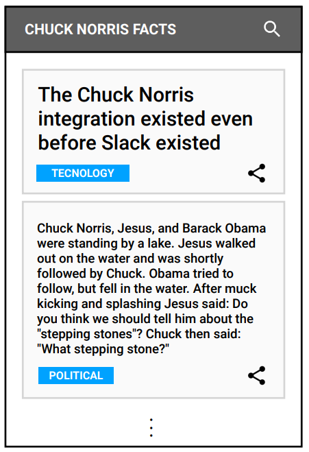
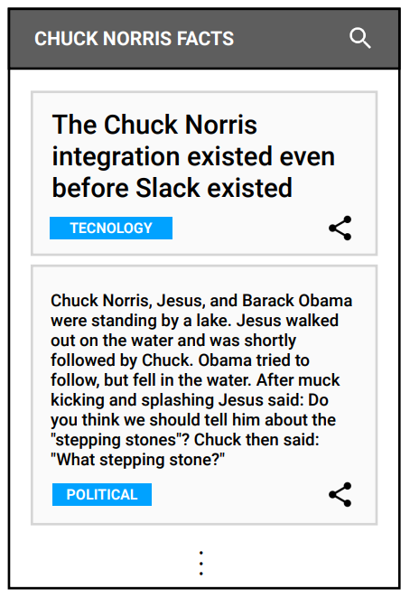
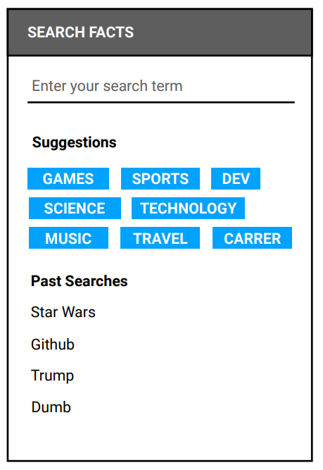
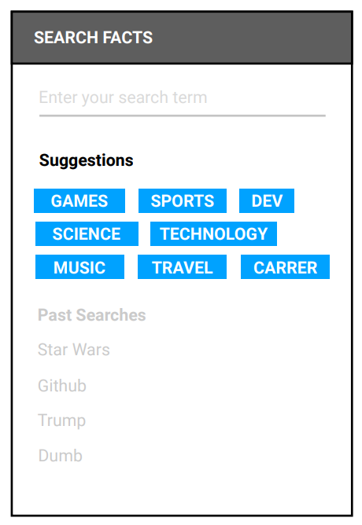
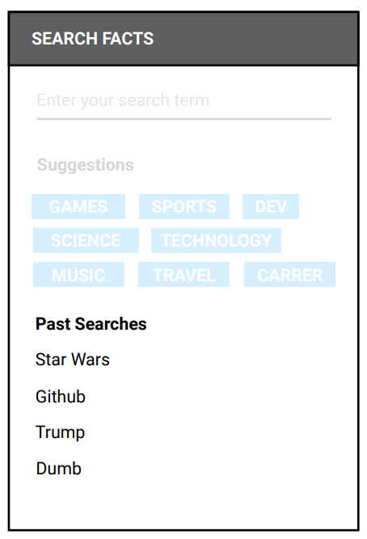
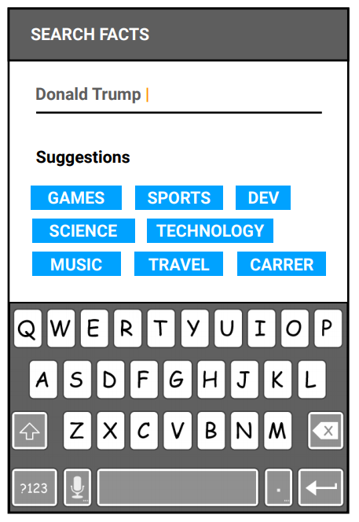

# Tech Challenge - Mobile Engineer

## We expect from your code

- Follow **Solid** principles and **Clean Code**
- Use **Dependency Injection** (using framework or not)
- Code in many ways and flows with **Automation Testing**:
  - Unit
  - Integration
  - Acceptance
- Performance testing as first-class citizen (using framework or not)
- Use **functional reactive programming** (RxSwift / RxJava)
- Create an **architectural resposabilities** well defined (MVC, MVVM, VIPER, etc)
- Implement a setup of **Continuous Integration** and it would be ready for Continuous Delivery
- Make an **optmizated user interface** using the best patteners from native UI Toolkit

## We expect from you

- Give us path that we could identify your tasks division, as tracking of execution of them (suggestion: Github projects)
- Follow the correct way of use Git, with good messages on commit and good size, branches as well
- Documentate some of your main decisions and approach in project
- Contact us in any weird thing or something that does not make sense
- We expect to find a minimal documentation that describe the basic to:
  - install the project to have up-and-running
  - running some builds and generate the artefacts from CLI

## Description

In this challenge you would create a small application to fetch an API Rest from [Chuck Norris facts](https://api.chucknorris.io/)
The app should allow the user search for facts througth API and share them with friends

The API documentation can be found on <https://api.chucknorris.io/>

---

### Part 1 - Facts 1

- The main screen shows the facts list from Chuck Norris. **On app's first access this screen is empty**
- This screen has a link to navigate to search page where user can type (see more details below)
- On success search one fact, the results are shown on main screen, such on image below

- Think that image as wireframe
- Use the appropriate UI following the platform patterns to **show the result list** and **navigate to search page**

### Part 1 - Facts 2

- Each item in list shold have an action to share the URL of that fact. Use the simplier system tool to do that
- The items in list would have many sizes. To handle that you should **use 2 different font sizes** as stated by fact's characteres lenght. Use the 80 characteres as magic number. This logic should be testable
- **Not all facts have a category**. In this case use **UNCATEGORIZED** in fact. This logic should be testable.
- This list is not paginable and neighter updatable by pull-to-refresh or something else

### Part 1 - Facts 3

- Your logic should be robust enought to show the user not only the results form success search but also the error states
- In particular you must offer states and implementations of UI and distincts actions to show connection errors and REST errors
- All possible output of screen should be automatizated testable, in integration and preferably in functional acceptable throught UI test

---

### Part 2 - Search 1

- The application's second screen allow user to type a term to search (should be send in API request)
- This screen allow a **tag cloud words** of suggestions of terms to search as well last searches terms performed by user
- Use the best UI approach as platform guidelines, in **text input** and **terms list**

- Think that image as wireframe

### Part 2 - Search 2

- The tag cloud words must have be filled from categories in REST API. **They must load in first time the apps is opened and persist offline in async way.** This logic should be testable
- From the categories available already loaded, 8 are randomly choosen to make that suggestion. This logic should be testable
- Each item in search suggestion has an action and should search the term in those categories as parameters

### Part 2 - Search 3

- The terms from past searches are available below the suggestions and are they persist offline. These terms have action and request a new search on API using that term.
- The terms list don't have duplicate entry. This logic should be testable
- The terms in list already searched are sort by recently used. The last term used is the first. This logic should be testable

### Part 2 - Search 4

- When user choose type a new term in search field, you should offer the input text keyboard with search action (enter)

---

## **Bonus**

We suggest you choose one of extras below to follow and increment your challenge solution

The aditional features shows a high level difficult rather those before and add you some points in your evaluation

You gain so much more points if do both extras

### **Extra 1 - Auto Retry**

- Add the feature to automatic retry by Reactive Programming to REST requests
- To do that, you should implement a logic while user see the loading state the application try a new API REST request if gets some network error or 5xx

#### To validate the extra 1

- Decide how to identify connection errors and which them would be handle
- Use the auto-retry logic in every place that use the requests
- Use the approach to do at maximum 2 try, with time interval of 4 and 8 seconds beetween them

These behaviors and definitions should be tested in unit and integration levels

### **Extra 2 - Offline Facts**

- **offline-first**
- To do that, you should persist data using some tool the success searches and relate them to terms already searched. The local storage must be the real origin source

#### To validate the extra 2

- The user can see all the offline cache of everything searched
- The user can see new facts related to a term already searched when online, if exist, independent they come from database
- Have up to 10 random facts in home screen when offline or online, as it is saved on device

These behaviors and definitions should be tested in unit and integration levels

---

### GOOD LUCK
